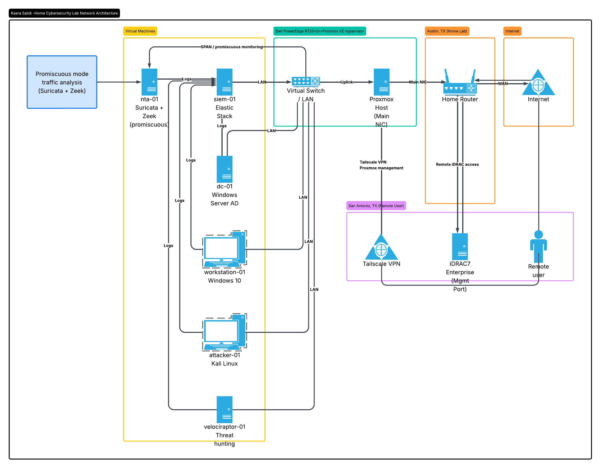

# Home Lab

I built this lab because I wanted real hands-on experience with the tools a SOC analyst actually uses. It runs on a Dell PowerEdge R720 I got from a decommissioned enterprise environment, managed remotely from San Antonio via iDRAC7 and Tailscale while the server sits in Austin.

---

## Hardware

| Component | Spec |
|---|---|
| Server | Dell PowerEdge R720 |
| CPU | Intel Xeon E5-2630 v2 — 8 cores @ 2.20GHz |
| RAM | 32GB DDR3 ECC (expanding to 64GB) |
| Storage | 1.2TB Dell SAS 10K + SATA SSD for Proxmox OS |
| RAID | Dell PERC H710P Mini — 1GB cache |
| Remote Mgmt | iDRAC7 Enterprise — KVM console, virtual media, hardware monitoring |
| Network | 4x Broadcom BCM5720 Gigabit NICs |
| Hypervisor | Proxmox VE |

---

## Architecture



```
Austin, TX (R720 server)        San Antonio, TX (me)
┌──────────────────────┐         ┌────────────────────┐
│  Proxmox VE          │◄──────► │  iDRAC7 Enterprise │
│  ├─ siem-01          │Tailscale│  Proxmox Web UI    │
│  ├─ dc-01 (AD)       │  VPN    │  SSH               │
│  ├─ workstation-01   │         └────────────────────┘
│  ├─ attacker (Kali)  │
│  ├─ nta-01           │
│  └─ velociraptor-01  │
└──────────────────────┘


```

---

## Detection Stack

| Tool | What I Use It For |
|---|---|
| Elastic Stack | Central SIEM — log ingestion, correlation, custom detection rules |
| Suricata | Network IDS — running in promiscuous mode on real home traffic |
| Zeek | Behavioral network analysis — conn logs, DNS, HTTP, SMB |
| Velociraptor | Endpoint forensics and proactive threat hunting |
| Kali Linux | Attack simulation — MITRE ATT&CK technique emulation |
| Active Directory | Realistic enterprise target environment |

---

## Hardware Troubleshooting Log

Getting this server running was not straightforward. I hit four separate hardware issues and worked through each one — documenting it here because the diagnostic process is half the point.


### Defective RAM Stick
**What happened:** Second NEMIX 32GB stick failed training in every slot I tried it in.  
**How I diagnosed it:** Swapped both sticks — error followed the specific stick to every slot, confirming it wasn't a slot issue.  
**What I did:** Returned the defective stick.

### No RAID Controller
**What happened:** Proxmox installer and every OS I tried showed "No Hard Disk found."  
**How I diagnosed it:** Dropped into the Linux terminal during the Proxmox install and ran `lspci | grep -i megaraid` — nothing returned. Ran full `lspci` output and confirmed no RAID controller showing in the PCI device list.  
**What I did:** Identified the server shipped with a PERC S110 (software RAID, SATA only) with no PERC H710 Mini installed. Ordered a PERC H710P Mini.


---

## Detection Rules

*Coming soon — will be added as the lab builds out.*

---

## Incident Reports

*Coming soon — documenting each attack scenario end to end.*

---


## Connect

- LinkedIn: www.linkedin.com/in/kasrasaiidi

